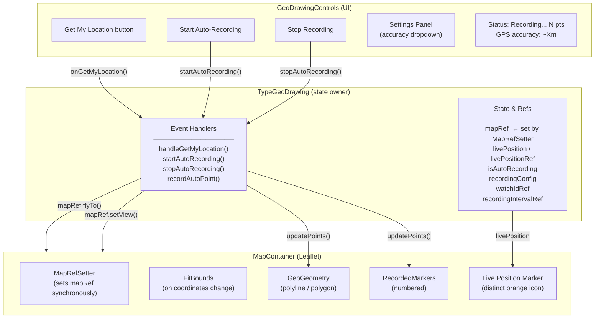
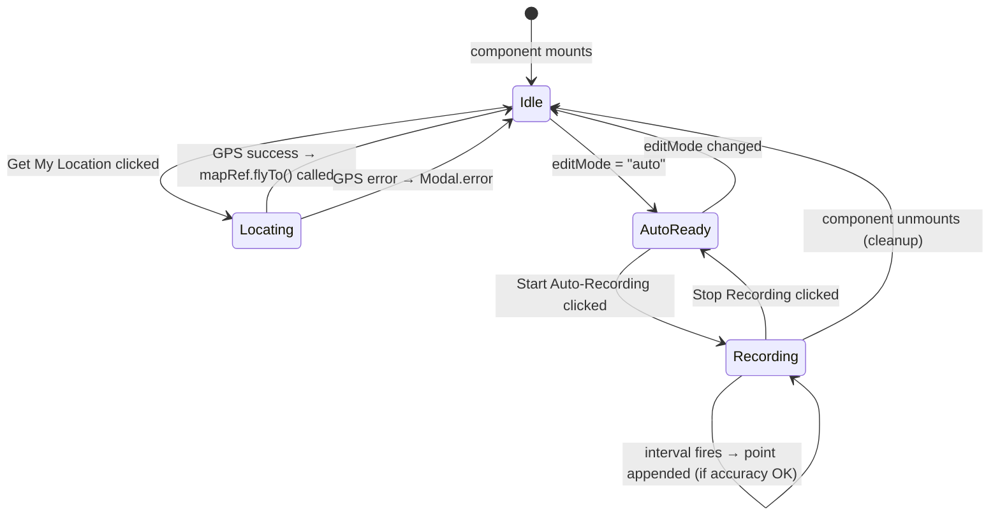
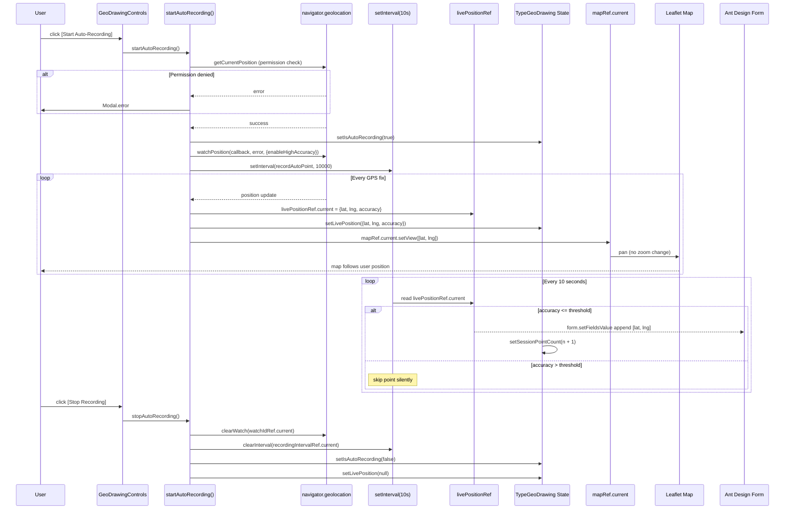
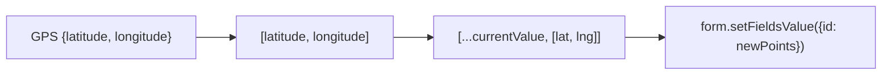
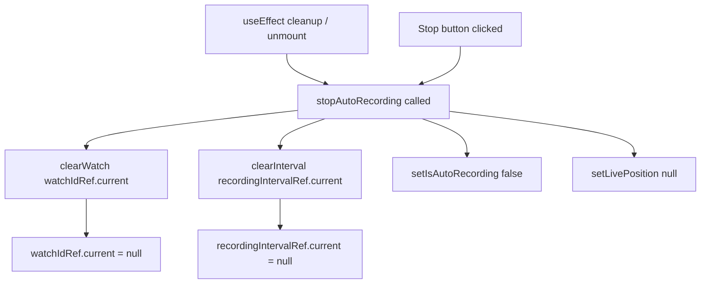

# Design: Get My Location Fix + Auto-Recording

## 1. Architecture Overview

Both features are contained entirely within `src/fields/TypeGeoDrawing.jsx`. Map panning (Get My Location + live tracking) is done imperatively via a `mapRef` — obtained through the `MapRefSetter` child component (react-leaflet v4 pattern).



---

## 2. State & Ref Design



### State Variables in `TypeGeoDrawing`

| Variable | Type | Purpose |
|----------|------|---------|
| `isLocating` | `boolean` | Loading state for the Get My Location button |
| `livePosition` | `{lat, lng, accuracy} \| null` | Current GPS fix during auto-recording (drives live marker render) |
| `isAutoRecording` | `boolean` | True while auto-recording is active |
| `recordingConfig` | `{interval: number, accuracy: number}` | Settings from panel (interval fixed 10s) |
| `currentPosition` | `{lat, lng} \| null` | Draggable marker position in manual mode |
| `sessionPointCount` | `number` | Points recorded in the current auto-recording session |

### Refs

| Ref | Type | Purpose |
|-----|------|---------|
| `mapRef` | `Leaflet.Map \| null` | Direct Leaflet map instance — set synchronously by `MapRefSetter`. Used for `flyTo()` (Get My Location) and `setView()` (live tracking). |
| `watchIdRef` | `number \| null` | Geolocation watch ID → `clearWatch()` on stop/unmount |
| `recordingIntervalRef` | `number \| null` | setInterval ID → `clearInterval()` on stop/unmount |
| `livePositionRef` | `{lat, lng, accuracy} \| null` | Mirrors `livePosition` state; avoids stale closure in interval callback |

---

## 3. Map Ref Pattern (react-leaflet v4)

### Problem with the old approach

`react-leaflet v4` removed the `whenCreated` prop. The old code:
```jsx
<MapContainer whenCreated={(map) => { mapRef.current = map; }} ...>
```
silently no-ops — `mapRef.current` stays `null` forever.

### Solution: `MapRefSetter` child component

```javascript
// src/support/GeoDrawingMapHandlers.jsx
export const MapRefSetter = ({ mapRef }) => {
  const map = useMap();   // synchronous — returns map instance immediately
  mapRef.current = map;  // set during render, before any effects or interactions
  return null;
};
```

Placed as the **first child** of `MapContainer`:
```jsx
<MapContainer center={mapCenter} zoom={13} ...>
  <MapRefSetter mapRef={mapRef} />
  <TileLayer ... />
  ...
</MapContainer>
```

### Why `ChangeView` was removed

The old `ChangeView` component called `map.setView(centre, zoom)` **directly in its render body**
(not inside a `useEffect`). This meant every React re-render — `setIsLocating`, `setCurrentPosition`,
`setLivePosition`, etc. — would fire `map.setView(questionCentre)` and override any `flyTo` that
had just run. The map always snapped back to Fiji (the question's `center` prop).

Fix: remove `ChangeView` from `TypeGeoDrawing`. `MapContainer`'s `center` prop is initial-only in
react-leaflet v4, so the map is positioned correctly at mount and never overridden again.

---

## 4. Data Flow: Get My Location Fix


---

## 5. Data Flow: Auto-Recording



---

## 6. Manual Mode: GPS Initialisation

When the user switches to Manual Record mode, the draggable marker must appear at their actual
GPS position, not at the question's `center` prop (which may be a faraway place like Fiji).

```javascript
useEffect(() => {
  if (editMode !== 'manual' || currentPosition) return;

  const fallbackPos = /* center prop or {lat:0,lng:0} */;

  if (navigator.geolocation) {
    navigator.geolocation.getCurrentPosition(
      (pos) => {
        const p = { lat: pos.coords.latitude, lng: pos.coords.longitude };
        setCurrentPosition(p);
        mapRef.current?.flyTo([p.lat, p.lng], 16);
      },
      () => setCurrentPosition(fallbackPos),
      { enableHighAccuracy: false, timeout: 5000 }
    );
  } else {
    setCurrentPosition(fallbackPos);
  }
}, [editMode, currentPosition, center]);
```

`enableHighAccuracy: false` and a 5-second timeout give a fast coarse fix — sufficient to place
the marker in the correct city while the device acquires a better signal.

---

## 7. UI Layout (implemented)

### Mode Toggle — vertical on all screen sizes

```
[ Tap to Add        ]   ← full-width button
[ Manual Record     ]
[ Auto-Record       ]
```

### Auto-Record Panel (not recording)

```
┌─────────────────────────────────────────────────┐
│  Auto-Recording Settings                        │
│  Interval:   10 seconds (fixed)                 │
│  Accuracy:   [15m ▼]  (5m / 10m / 15m / 20m)   │
│                                                 │
│  [ Start Auto-Recording  ]  ← full-width        │
└─────────────────────────────────────────────────┘
```

**With `extra.geoConfig.accuracyThreshold` set:**
```
│  Accuracy:   10m (configured)    ← read-only
```

### Auto-Record Panel (recording)

```
┌─────────────────────────────────────────────────┐
│  ● Recording...  7 points                       │
│  GPS accuracy: ~8m                              │
│                                                 │
│  [ Stop Recording          ]  ← danger, full-w  │
└─────────────────────────────────────────────────┘
```

---

## 8. Coordinate Format

Storage format is `[[lat, lng], ...]` (Leaflet convention — latitude first).
All handlers store and read in this format consistently.



> Do **not** apply a `[lng, lat]` → `[lat, lng]` conversion. The components (`GeoGeometry`,
> `FitBounds`, `RecordedMarkers`) all consume the stored format directly without swapping axes.

---

## 9. Cleanup Contract



`stopAutoRecording` is wrapped in `useCallback` with no changing dependencies, making it safe to
include in `useEffect` dependency arrays and ensuring a stable reference across renders.
