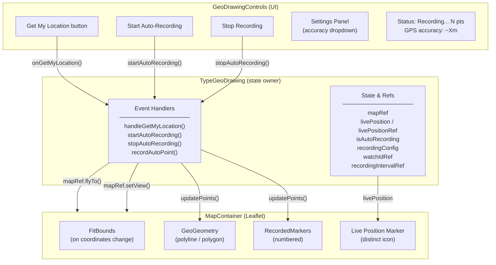
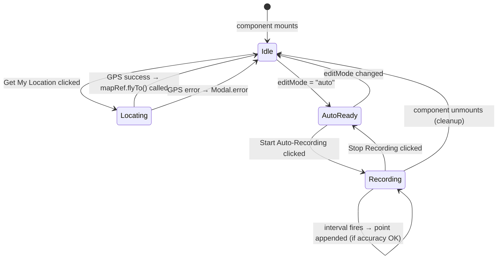
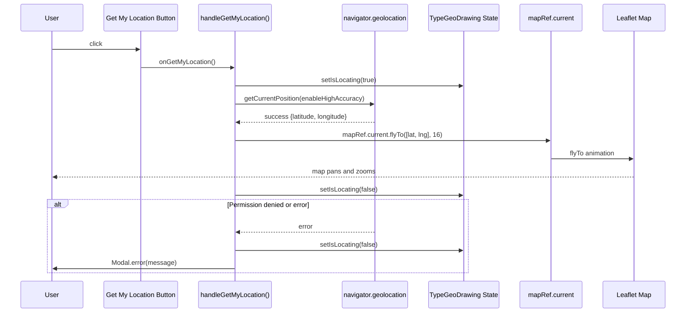
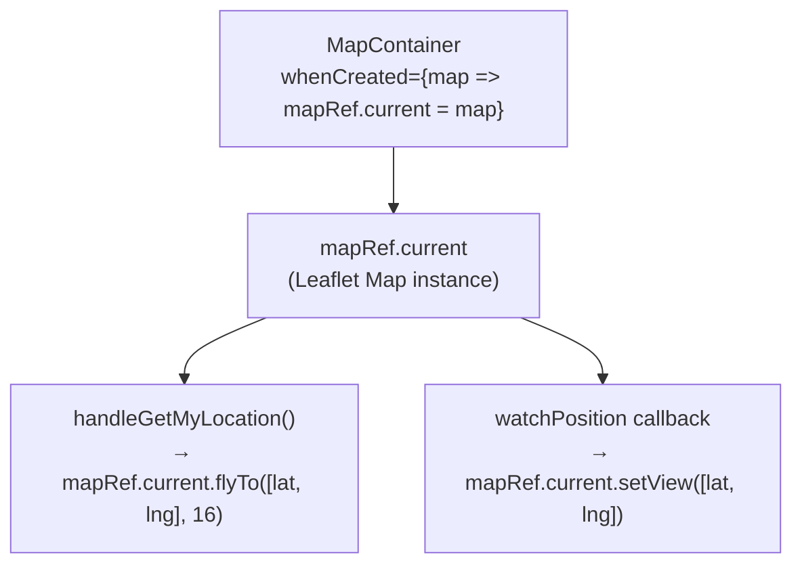
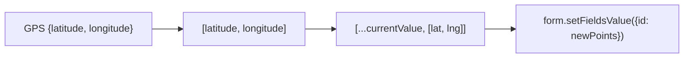
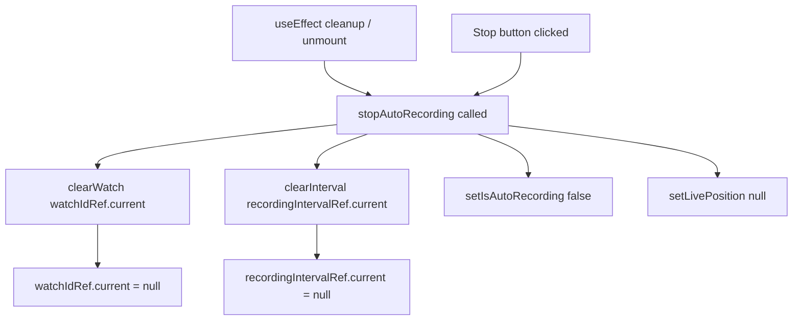

# Design: Get My Location Fix + Auto-Recording

## 1. Architecture Overview

Both features are contained entirely within `src/fields/TypeGeoDrawing.jsx`. Map panning (Get My Location + live tracking) is done imperatively via a `mapRef` — no extra components inside `MapContainer` are needed for either operation.



---

## 2. State & Ref Design



### State Variables Added to `TypeGeoDrawing`

| Variable | Type | Purpose |
|----------|------|---------|
| `isLocating` | `boolean` | Loading state for the Get My Location button |
| `livePosition` | `{lat, lng, accuracy} \| null` | Current GPS fix during auto-recording (drives live marker render) |
| `isAutoRecording` | `boolean` | True while auto-recording is active |
| `recordingConfig` | `{interval: number, accuracy: number}` | Settings from panel (interval fixed 10s) |

### Refs Added

| Ref | Type | Purpose |
|-----|------|---------|
| `mapRef` | `Leaflet.Map \| null` | Direct Leaflet map instance — used for `flyTo()` (Get My Location) and `setView()` (live tracking). Replaces the need for `FlyTo` and `LiveTracker` components. |
| `watchIdRef` | `number \| null` | Geolocation watch ID → `clearWatch()` on stop/unmount |
| `recordingIntervalRef` | `number \| null` | setInterval ID → `clearInterval()` on stop/unmount |
| `livePositionRef` | `{lat, lng, accuracy} \| null` | Mirrors `livePosition` state; avoids stale closure in interval callback |

---

## 3. Data Flow: Get My Location Fix



---

## 4. Data Flow: Auto-Recording


---

## 5. Inner Component Design

### 5.1 Map Ref Pattern

`FlyTo` and `LiveTracker` are **not** separate components. Both operations are called imperatively via `mapRef.current`, which holds the Leaflet map instance obtained through `MapContainer`'s `whenCreated` callback.



| Operation | Called from | Method |
|-----------|------------|--------|
| Get My Location pan | `handleGetMyLocation()` handler | `mapRef.current.flyTo([lat, lng], 16)` |
| Live tracking pan | `watchPosition` callback inside `startAutoRecording()` | `mapRef.current.setView([lat, lng])` |

**Why this is simpler than components**: both operations are one-liners triggered by existing event callbacks — there is no React state change driving them, so a reactive component would add indirection without benefit.

### 5.2 Live Position Marker

A new orange marker rendered inside `MapContainer` when `livePosition` is set and `isAutoRecording` is true. Uses a distinct icon (pulsing orange dot) to visually separate it from numbered recorded-point markers (blue circles).

```javascript
// Icon: orange circle with white border
const createLivePositionIcon = () => L.divIcon({
  className: 'live-position-icon',
  html: `<div style="
    width: 16px; height: 16px;
    background: #fa8c16;
    border: 2px solid white;
    border-radius: 50%;
    box-shadow: 0 0 0 4px rgba(250,140,22,0.3);
  "></div>`,
  iconSize: [16, 16],
  iconAnchor: [8, 8],
});
```

---

## 6. UI Layout

### Mode Toggle (updated)

```
Mode:
[ Tap to Add ]  [ Manual Record ]  [ Auto-Record ]
```

### Auto-Record Panel (when auto mode selected, not recording)

**Without JSON config** — surveyor can adjust threshold:
```
┌─────────────────────────────────────────────────┐
│  Auto-Recording Settings                        │
│  ─────────────────────────────────────────────  │
│  Interval:   10 seconds (fixed)                 │
│  Accuracy:   [15m ▼]  (5m / 10m / 15m / 20m)   │
│                                                 │
│  [ Start Auto-Recording ]                       │
└─────────────────────────────────────────────────┘
```

**With `extra.geoConfig.accuracyThreshold` in form JSON** — threshold locked:
```
┌─────────────────────────────────────────────────┐
│  Auto-Recording Settings                        │
│  ─────────────────────────────────────────────  │
│  Interval:   10 seconds (fixed)                 │
│  Accuracy:   10m (configured)                   │
│                                                 │
│  [ Start Auto-Recording ]                       │
└─────────────────────────────────────────────────┘
```

### Auto-Record Panel (while recording)

```
┌─────────────────────────────────────────────────┐
│  ● Recording...  7 points                       │
│  GPS accuracy: ~8m                              │
│                                                 │
│  [ Stop Recording ]  (danger button)            │
└─────────────────────────────────────────────────┘
```

---

## 7. Coordinate Format (unchanged)

Storage format remains `[[lat, lng], ...]` (existing convention in this component). Auto-recorded points use the same format.



---

## 8. Cleanup Contract



All cleanup paths call the same `stopAutoRecording` function to ensure consistency.
