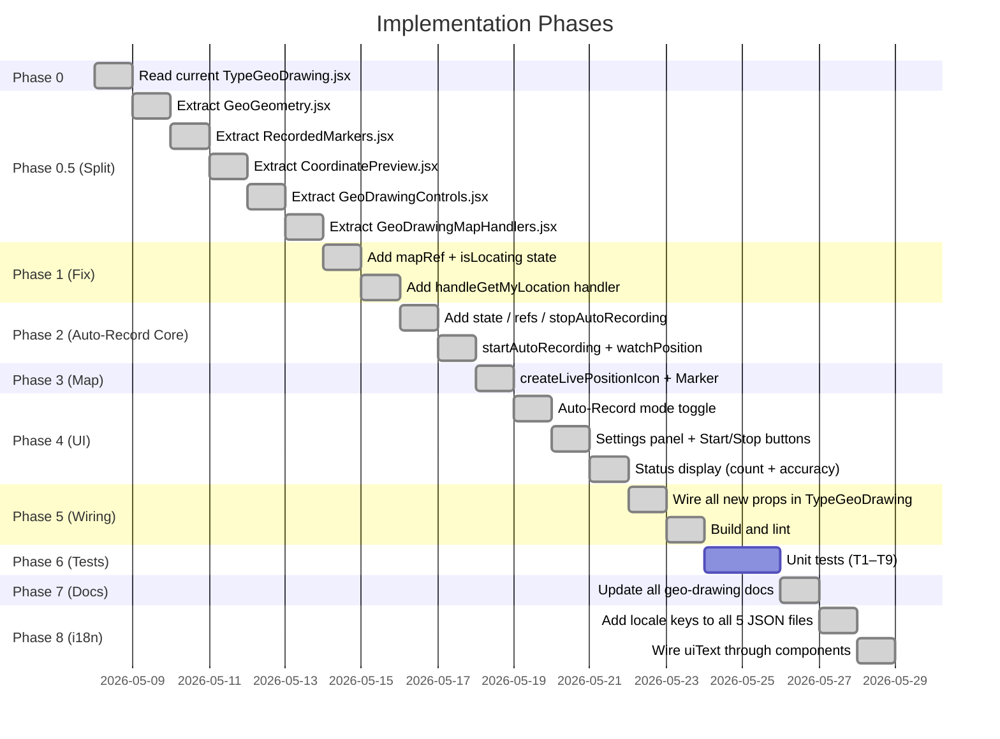
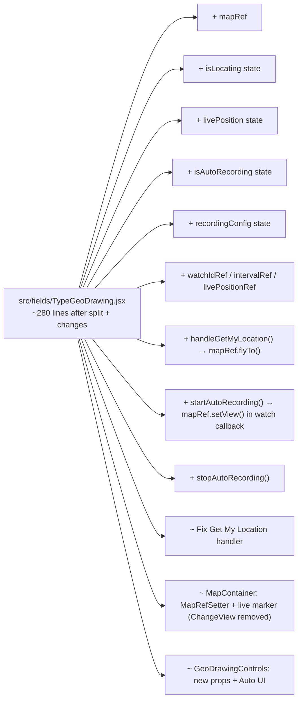
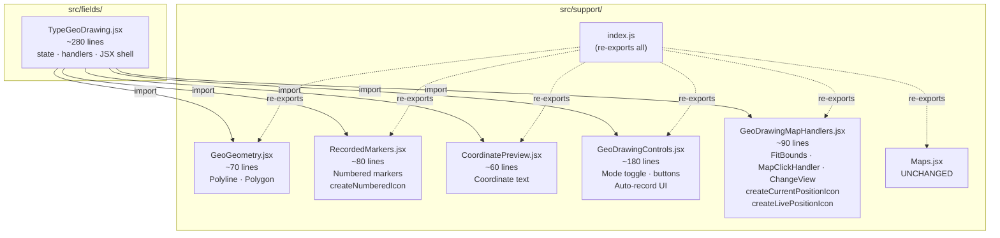

# Implementation Plan: Get My Location Fix + Auto-Recording

## Overview

Components were split from `TypeGeoDrawing.jsx` into five dedicated files in `src/support/` (Phase 0.5). Core logic, UI controls, and map features are fully implemented (Phases 1–5). Remaining work: unit tests (Phase 6), user docs (Phase 7), and i18n (Phase 8).

---

## Phase 0 — Understand Current State ✅



---

## Phase 1 — Fix: Get My Location Button ✅

> **Status**: Implemented in `src/fields/TypeGeoDrawing.jsx`. `mapRef` wired via `MapRefSetter` child component (react-leaflet v4 — `whenCreated` was removed). `handleGetMyLocation` calls `mapRef.current?.flyTo()`.

### Step 1.1 — Add `mapRef` and `isLocating` state

**Location**: Inside `TypeGeoDrawing` component, after existing `useState` / `useRef` declarations.

```javascript
const mapRef = useRef(null);               // Leaflet map instance
const [isLocating, setIsLocating] = useState(false);
```

No `flyToPosition` state is needed. The map is panned imperatively via `mapRef.current.flyTo()`.

### Step 1.2 — Attach `mapRef` via `MapRefSetter` child component

**Location**: First child inside `<MapContainer>`.

`whenCreated` was removed in react-leaflet v4 and silently no-ops. Use `MapRefSetter` instead:

```javascript
// src/support/GeoDrawingMapHandlers.jsx
export const MapRefSetter = ({ mapRef }) => {
  const map = useMap();
  mapRef.current = map;  // synchronous — set before any interaction
  return null;
};
```

```jsx
<MapContainer center={mapCenter} zoom={13} ...>
  <MapRefSetter mapRef={mapRef} />
  <TileLayer ... />
  ...
</MapContainer>
```

> Also: `ChangeView` has been **removed** from `TypeGeoDrawing`. It called `map.setView(centre)`
> in its render body on every re-render, overriding `flyTo`. `MapContainer`'s `center` prop is
> initial-only in react-leaflet v4 and handles the initial position without interference.

### Step 1.3 — Add `handleGetMyLocation` handler

**Location**: Inside `TypeGeoDrawing`, alongside other event handlers.

```javascript
const handleGetMyLocation = () => {
  if (!navigator.geolocation) {
    Modal.error({
      title: 'Geolocation not supported',
      content: 'Your browser does not support geolocation.',
    });
    return;
  }
  setIsLocating(true);
  navigator.geolocation.getCurrentPosition(
    (pos) => {
      const { latitude, longitude } = pos.coords;
      mapRef.current?.flyTo([latitude, longitude], 16);
      setIsLocating(false);
    },
    (err) => {
      setIsLocating(false);
      Modal.error({
        title: 'Error getting location',
        content: err.message || 'Unable to retrieve your location.',
      });
    },
    { enableHighAccuracy: true, timeout: 10000 }
  );
};
```

**Why `mapRef.current?.flyTo()` instead of a component**: the call is a one-liner inside an existing callback — no React state change drives it, so a reactive `<FlyTo>` component would add indirection without benefit.

### Step 1.4 — Update `GeoDrawingControls` button

**Location**: `GeoDrawingControls.jsx`, "Get My Location" button.

**Remove** the current broken inline handler. **Replace** with a simple call to the prop:

```jsx
<Button
  size="small"
  loading={isLocating}
  onClick={onGetMyLocation}
>
  <Space size="small">
    <MdMyLocation />
    <span>Get My Location</span>
  </Space>
</Button>
```

**Props added to `GeoDrawingControls`**:

| Prop | Type | Purpose |
|------|------|---------|
| `onGetMyLocation` | `() => void` | Calls `handleGetMyLocation` in parent |
| `isLocating` | `boolean` | Controls button loading state |

### Step 1.5 — Wire props in `TypeGeoDrawing`

```jsx
<GeoDrawingControls
  ...existing props...
  onGetMyLocation={handleGetMyLocation}
  isLocating={isLocating}
/>
```

---

## Phase 2 — Auto-Recording: Core Logic ✅

> **Status**: Implemented. `startAutoRecording` / `stopAutoRecording` (stable `useCallback([])`) + `useEffect(() => stopAutoRecording, [stopAutoRecording])` cleanup pattern. `livePositionRef` prevents stale closure in `setInterval`.

### Step 2.1 — Add new state and refs

**Location**: Inside `TypeGeoDrawing`, after existing state.

```javascript
// Auto-recording state
const [livePosition, setLivePosition] = useState(null);
const [isAutoRecording, setIsAutoRecording] = useState(false);
const [recordingConfig, setRecordingConfig] = useState({
  interval: 10,    // seconds (fixed)
  accuracy: extra?.geoConfig?.accuracyThreshold ?? 15,  // JSON config or fallback 15m
});
const lockedAccuracy = extra?.geoConfig?.accuracyThreshold ?? null; // null = surveyor can adjust
const [sessionPointCount, setSessionPointCount] = useState(0);

// Refs to avoid stale closures
const livePositionRef = useRef(null);
const watchIdRef = useRef(null);
const recordingIntervalRef = useRef(null);
```

### Step 2.2 — Add `startAutoRecording` handler

```javascript
const startAutoRecording = () => {
  if (!navigator.geolocation) {
    Modal.error({
      title: 'Geolocation not supported',
      content: 'Your browser does not support geolocation.',
    });
    return;
  }

  // First verify permission with one-shot call
  navigator.geolocation.getCurrentPosition(
    () => {
      setIsAutoRecording(true);
      setSessionPointCount(0);

      // Continuous position watch for live tracking + map panning
      watchIdRef.current = navigator.geolocation.watchPosition(
        (pos) => {
          const { latitude, longitude, accuracy } = pos.coords;
          const fix = { lat: latitude, lng: longitude, accuracy };
          livePositionRef.current = fix;
          setLivePosition(fix);
          mapRef.current?.setView([latitude, longitude]); // pan map, keep zoom
        },
        (err) => {
          console.warn('GPS watch error:', err.message);
        },
        { enableHighAccuracy: true, maximumAge: 5000 }
      );

      // Record point on interval
      recordingIntervalRef.current = setInterval(() => {
        const pos = livePositionRef.current;
        if (!pos) return;
        if (pos.accuracy > recordingConfig.accuracy) return; // below threshold

        const newPoint = [pos.lat, pos.lng];
        const currentPoints = form.getFieldValue(id) || [];
        form.setFieldsValue({ [id]: [...currentPoints, newPoint] });
        setSessionPointCount((n) => n + 1);
      }, recordingConfig.interval * 1000);
    },
    (err) => {
      Modal.error({
        title: 'Location permission required',
        content: err.message || 'Please allow location access to use auto-recording.',
      });
    },
    { enableHighAccuracy: true, timeout: 10000 }
  );
};
```

### Step 2.3 — Add `stopAutoRecording` handler

Wrap in `useCallback` with empty deps. Every value it touches is either a ref (stable object identity) or a state setter (guaranteed stable by React) — so `[]` is genuinely correct and ESLint will not complain.

```javascript
const stopAutoRecording = useCallback(() => {
  if (watchIdRef.current !== null) {
    navigator.geolocation.clearWatch(watchIdRef.current);
    watchIdRef.current = null;
  }
  if (recordingIntervalRef.current !== null) {
    clearInterval(recordingIntervalRef.current);
    recordingIntervalRef.current = null;
  }
  livePositionRef.current = null;
  setIsAutoRecording(false);
  setLivePosition(null);
}, []); // refs + state setters are stable — empty deps is correct
```

### Step 2.4 — Subscribe / unsubscribe on mount / unmount

With `stopAutoRecording` stable via `useCallback`, it can be listed in deps normally. Return it directly as the cleanup function — no wrapper needed, no ESLint suppression comment.

```javascript
useEffect(() => {
  return stopAutoRecording; // called on unmount (unsubscribe)
}, [stopAutoRecording]);
```

---

## Phase 3 — Auto-Recording: Map Components ✅

> **Status**: `createLivePositionIcon` lives in `src/support/GeoDrawingMapHandlers.jsx`. Orange pulsing marker rendered in `TypeGeoDrawing` when `isAutoRecording && livePosition`.

Live tracking is already handled by `mapRef.current.setView()` inside the `watchPosition` callback added in Step 2.2. No `LiveTracker` component is needed.

### Step 3.1 — Add `createLivePositionIcon` function

```javascript
const createLivePositionIcon = () =>
  L.divIcon({
    className: 'live-position-icon',
    html: `<div style="
      width: 16px;
      height: 16px;
      background: #fa8c16;
      border: 2px solid white;
      border-radius: 50%;
      box-shadow: 0 0 0 4px rgba(250,140,22,0.3);
    "></div>`,
    iconSize: [16, 16],
    iconAnchor: [8, 8],
  });
```

### Step 3.2 — Render live position marker inside `MapContainer`

Add inside `MapContainer`, after the recorded markers block. No `LiveTracker` wrapper needed — map panning is already done via `mapRef` in the `watchPosition` callback.

```jsx
{/* Live GPS marker during auto-recording */}
{isAutoRecording && livePosition && (
  <Marker
    position={[livePosition.lat, livePosition.lng]}
    icon={createLivePositionIcon()}
  >
    <Tooltip permanent={false} direction="top">
      <div style={{ fontSize: '12px' }}>
        <strong>Current GPS</strong>
        <br />
        Accuracy: ~{Math.round(livePosition.accuracy)}m
      </div>
    </Tooltip>
  </Marker>
)}
```

---

## Phase 4 — Auto-Recording: UI Controls ✅

> **Status**: Implemented in `src/support/GeoDrawingControls.jsx`. Mode toggle has three buttons (Tap / Manual / Auto-Record). Settings panel shows accuracy dropdown or locked label depending on `lockedAccuracy`. Start/Stop buttons and live status display wired.

### Step 4.1 — Add "Auto-Record" tab to mode toggle

In `GeoDrawingControls`, add a third button to the mode selector:

```jsx
<Button
  size="small"
  type={editMode === 'auto' ? 'primary' : 'default'}
  onClick={() => onEditModeChange('auto')}
  disabled={isAutoRecording}
>
  Auto-Record
</Button>
```

### Step 4.2 — Add settings panel for auto mode

In `GeoDrawingControls`, render when `editMode === 'auto'`:

```jsx
{editMode === 'auto' && (
  <div style={{
    border: '1px solid #d9d9d9',
    borderRadius: 6,
    padding: '8px 12px',
    background: '#fafafa',
    fontSize: '12px',
  }}>
    <div style={{ fontWeight: 600, marginBottom: 6 }}>Auto-Recording Settings</div>
    <Space direction="vertical" size={4}>
      <div>Interval: <strong>10 seconds</strong> (fixed)</div>
      <Space size="small">
        <span>Accuracy threshold:</span>
        {lockedAccuracy !== null ? (
          <span style={{ fontWeight: 600 }}>{lockedAccuracy}m (configured)</span>
        ) : (
          <Select
            size="small"
            value={recordingConfig.accuracy}
            onChange={(val) => onConfigChange({ ...recordingConfig, accuracy: val })}
            disabled={isAutoRecording}
            style={{ width: 70 }}
            options={[
              { value: 5, label: '5m' },
              { value: 10, label: '10m' },
              { value: 15, label: '15m' },
              { value: 20, label: '20m' },
            ]}
          />
        )}
      </Space>
    </Space>
  </div>
)}
```

### Step 4.3 — Add Start / Stop buttons and status display

In `GeoDrawingControls`, render when `editMode === 'auto'`:

```jsx
{editMode === 'auto' && (
  isAutoRecording ? (
    <Space direction="vertical" size={4}>
      <div style={{ fontSize: '12px', color: '#595959' }}>
        <span style={{ color: '#ff4d4f' }}>●</span>
        {' '}Recording... <strong>{sessionPointCount}</strong> points
      </div>
      {livePosition && (
        <div style={{ fontSize: '11px', color: '#8c8c8c' }}>
          GPS accuracy: ~{Math.round(livePosition.accuracy)}m
        </div>
      )}
      <Button
        size="small"
        danger
        onClick={onStopRecording}
      >
        Stop Recording
      </Button>
    </Space>
  ) : (
    <Button
      size="small"
      type="primary"
      onClick={onStartRecording}
    >
      Start Auto-Recording
    </Button>
  )
)}
```

**New props required in `GeoDrawingControls`**:

| Prop | Type | Purpose |
|------|------|---------|
| `recordingConfig` | `{interval, accuracy}` | Current recording settings |
| `onConfigChange` | `(config) => void` | Updates config in parent |
| `isAutoRecording` | `boolean` | Controls button visibility |
| `sessionPointCount` | `number` | Points recorded this session |
| `livePosition` | `{lat, lng, accuracy} \| null` | For accuracy display |
| `onStartRecording` | `() => void` | Calls `startAutoRecording` |
| `onStopRecording` | `() => void` | Calls `stopAutoRecording` |

### Step 4.4 — Update hint text for auto mode

```javascript
{editMode === 'auto' && !isAutoRecording && 'Press Start to begin recording your path'}
{editMode === 'auto' && isAutoRecording && 'Walk your route — points are saved every 10 seconds'}
```

---

## Phase 5 — Wiring in `TypeGeoDrawing` ✅

> **Status**: All props passed to `GeoDrawingControls`. `TypeGeoDrawing.jsx` is ~280 lines (down from 722).

Pass all new props to `<GeoDrawingControls>`:

```jsx
<GeoDrawingControls
  {/* existing */}
  editMode={editMode}
  onEditModeChange={setEditMode}
  pointCount={currentValue?.length || 0}
  type={type}
  onUndo={handleUndo}
  onClear={handleClear}
  onRecord={handleRecordPoint}
  disabled={disabled}
  currentPosition={currentPosition}
  uiOptions={uiOptions}
  {/* Phase 1 additions */}
  onGetMyLocation={handleGetMyLocation}
  isLocating={isLocating}
  {/* Phase 2-4 additions */}
  recordingConfig={recordingConfig}
  onConfigChange={setRecordingConfig}
  isAutoRecording={isAutoRecording}
  sessionPointCount={sessionPointCount}
  livePosition={livePosition}
  onStartRecording={startAutoRecording}
  onStopRecording={stopAutoRecording}
  lockedAccuracy={lockedAccuracy}
/>
```

---

## Phase 6 — Testing

### Unit Tests

```mermaid
graph TD
    T1["Test: Get My Location\ncalls mapRef.flyTo on success"]
    T2["Test: Get My Location\nshows error modal on failure"]
    T3["Test: startAutoRecording\ncalls watchPosition + setInterval"]
    T4["Test: watchPosition callback\ncalls mapRef.setView"]
    T5["Test: stopAutoRecording\ncalls clearWatch + clearInterval"]
    T6["Test: interval callback\nappends point when accuracy OK"]
    T7["Test: interval callback\nskips point when accuracy bad"]
    T8["Test: unmount\ncalls stopAutoRecording"]
    T9["Test: disabled prop\nhides auto-record controls"]
```



---

## File Change Summary



The components **must** be split into `src/support/` to keep `TypeGeoDrawing.jsx` under 400 lines and follow the project's small-file principle. See **Phase 0.5** below.

---

## Phase 0.5 — Component Split into `src/support/` ✅

> **Status**: All five files created. `TypeGeoDrawing.jsx` reduced to ~280 lines. Build and lint pass with zero errors.

This phase must be completed **before** Phases 1–5. Each inner component currently inside `TypeGeoDrawing.jsx` is extracted into its own file in `src/support/`, following the same one-component-per-file convention already used by `FieldLabel.jsx`, `ErrorComponent.jsx`, `ImagePreview.jsx`, etc.

### Directory Structure After Split

```
src/
├── fields/
│   └── TypeGeoDrawing.jsx       EDITED  ~280 lines (state + handlers + JSX shell only)
└── support/
    ├── index.js                 EDITED  (add 5 new exports)
    ├── Maps.jsx                 UNCHANGED (TypeGeo single-point field)
    │
    ├── GeoGeometry.jsx          NEW  ~70 lines   Polyline / Polygon renderer
    ├── RecordedMarkers.jsx      NEW  ~80 lines   Numbered markers + createNumberedIcon
    ├── CoordinatePreview.jsx    NEW  ~60 lines   Coordinate count + point list text
    ├── GeoDrawingControls.jsx   NEW  ~180 lines  Mode toggle + action buttons + auto-record UI
    └── GeoDrawingMapHandlers.jsx NEW  ~110 lines MapRefSetter · FitBounds · MapClickHandler ·
                                                   ChangeView (Maps.jsx only) ·
                                                   createCurrentPositionIcon ·
                                                   createLivePositionIcon
```

---

### New File 1: `src/support/GeoGeometry.jsx`

**Responsibility**: Renders the recorded geometry on the map — a `<Polyline>` for geotrace, a `<Polygon>` for geoshape. Returns `null` when coordinates are absent or invalid.

**Single default export**: `GeoGeometry`

```javascript
// src/support/GeoGeometry.jsx
import React from 'react';
import { Polyline, Polygon } from 'react-leaflet';

const GeoGeometry = ({ coordinates, type }) => {
  // validate + render Polyline or Polygon
};

export default GeoGeometry;
```

---

### New File 2: `src/support/RecordedMarkers.jsx`

**Responsibility**: Renders the numbered blue `<Marker>` components for each recorded point. Owns the `createNumberedIcon` factory because it is the only consumer.

**Exports**:
- `createDotIcon` (named) — small blue dot DivIcon; number is hidden by default, shown in tooltip on hover
- `RecordedMarkers` (default) — the marker list component

**Marker behaviour**: dots only at rest; hovering shows `<Tooltip permanent={false}>` with "Point N" and coordinates. Click opens a remove confirmation.

```javascript
// src/support/RecordedMarkers.jsx
import React from 'react';
import { Marker, Tooltip } from 'react-leaflet';
import { Modal } from 'antd';
import L from 'leaflet';

export const createDotIcon = () => { ... }; // 10px blue circle, no number

const RecordedMarkers = ({ coordinates, onRemovePoint, disabled }) => { ... };

export default RecordedMarkers;
```

---

### New File 3: `src/support/CoordinatePreview.jsx`

**Responsibility**: Renders the plain-text coordinate summary above the map (count, first/last points, type label). No Leaflet dependency.

**Single default export**: `CoordinatePreview`

```javascript
// src/support/CoordinatePreview.jsx
import React from 'react';

const CoordinatePreview = ({ coordinates, type, showDetails }) => { ... };

export default CoordinatePreview;
```

---

### New File 4: `src/support/GeoDrawingControls.jsx`

**Responsibility**: The full control panel rendered *above* the map — mode toggle (Tap / Manual / Auto-Record), action buttons (Undo, Clear, Record, Get My Location), auto-record settings panel, and recording status display. Stateless: receives everything via props.

**Single default export**: `GeoDrawingControls`

**Complete props** (all phases combined):

| Prop | Type | Phase added |
|------|------|-------------|
| `editMode` | `'tap' \| 'manual' \| 'auto'` | existing |
| `onEditModeChange` | `(mode) => void` | existing |
| `pointCount` | `number` | existing |
| `type` | `'geotrace' \| 'geoshape'` | existing |
| `onUndo` | `() => void` | existing |
| `onClear` | `() => void` | existing |
| `onRecord` | `() => void` | existing |
| `disabled` | `boolean` | existing |
| `currentPosition` | `{lat, lng} \| null` | existing |
| `uiOptions` | `object` | existing |
| `onGetMyLocation` | `() => void` | Phase 1 |
| `isLocating` | `boolean` | Phase 1 |
| `recordingConfig` | `{interval, accuracy}` | Phase 4 |
| `onConfigChange` | `(config) => void` | Phase 4 |
| `isAutoRecording` | `boolean` | Phase 4 |
| `sessionPointCount` | `number` | Phase 4 |
| `livePosition` | `{lat, lng, accuracy} \| null` | Phase 4 |
| `onStartRecording` | `() => void` | Phase 4 |
| `onStopRecording` | `() => void` | Phase 4 |
| `lockedAccuracy` | `number \| null` | Phase 4 — `null` = show dropdown; number = show read-only label |

```javascript
// src/support/GeoDrawingControls.jsx
import React from 'react';
import { Button, Space, Select } from 'antd';
import { MdMyLocation } from 'react-icons/md';

const GeoDrawingControls = ({ ...allProps }) => { ... };

export default GeoDrawingControls;
```

---

### New File 5: `src/support/GeoDrawingMapHandlers.jsx`

**Responsibility**: Leaflet hook-based components that live *inside* `MapContainer` but produce no visible DOM — pure map side-effects. Also owns icon factories for markers rendered inline in `TypeGeoDrawing.jsx`.

**Boundary rule**: every export here either calls `useMap`, calls `useMapEvents`, or creates a Leaflet `DivIcon`. Nothing else belongs here.

**Note**: `flyTo` (Get My Location) and `setView` (live tracking) are **not** in this file — they are called directly on `mapRef.current` from handler functions in `TypeGeoDrawing.jsx`.

**Exports** (all named):

| Export | Type | Description |
|--------|------|-------------|
| `MapRefSetter` | component | Sets `mapRef.current = map` synchronously via `useMap()` (react-leaflet v4 pattern) |
| `FitBounds` | component | `map.fitBounds()` to recorded coordinates on mount/update |
| `MapClickHandler` | component | `useMapEvents` — fires `onMapClick` in tap mode |
| `ChangeView` | component | `map.setView()` on mount only (present in file, but NOT used in TypeGeoDrawing — kept for Maps.jsx compatibility) |
| `createCurrentPositionIcon` | function | Red crosshair DivIcon (manual mode draggable marker) |
| `createLivePositionIcon` | function | Orange pulsing DivIcon (auto-record live position) |

```javascript
// src/support/GeoDrawingMapHandlers.jsx
import React, { useEffect } from 'react';
import { useMap, useMapEvents } from 'react-leaflet';
import L from 'leaflet';

export const createCurrentPositionIcon = () => { ... };
export const createLivePositionIcon = () => { ... };

export const FitBounds = ({ coordinates }) => { ... };
export const MapClickHandler = ({ editMode, disabled, onMapClick }) => { ... };
export const ChangeView = ({ center, zoom }) => { ... };
```

---

### Edited File: `src/support/index.js`

Add five new export lines:

```javascript
// existing exports unchanged
export { default as Maps } from './Maps';
// ... (all current exports) ...

// new exports
export { default as GeoGeometry } from './GeoGeometry';
export { default as RecordedMarkers, createNumberedIcon } from './RecordedMarkers';
export { default as CoordinatePreview } from './CoordinatePreview';
export { default as GeoDrawingControls } from './GeoDrawingControls';
export * from './GeoDrawingMapHandlers';
```

---

### Edited File: `src/fields/TypeGeoDrawing.jsx`

After the split, the file contains only:
- Leaflet default-icon fix (module scope)
- `defaultCenter` constant
- `TypeGeoDrawing` component: all `useState` / `useRef` / `useMemo` / `useEffect`, all event handlers, validation rules, JSX shell

**Import block**:

```javascript
import React, { useState, useEffect, useMemo, useRef } from 'react';
import { Form, Modal } from 'antd';
import { MapContainer, TileLayer, Marker, Tooltip } from 'react-leaflet';
import L from 'leaflet';
import 'leaflet/dist/leaflet.css';
import { FieldLabel } from '../support';
import GlobalStore from '../lib/store';
import GeoGeometry from '../support/GeoGeometry';
import RecordedMarkers from '../support/RecordedMarkers';
import CoordinatePreview from '../support/CoordinatePreview';
import GeoDrawingControls from '../support/GeoDrawingControls';
import {
  FitBounds,
  MapClickHandler,
  MapRefSetter,
  createCurrentPositionIcon,
  createLivePositionIcon,
} from '../support/GeoDrawingMapHandlers';
```

---

### Component Dependency Diagram



---

### Line-Count Budget

| File | Before | After | Delta |
|------|--------|-------|-------|
| `src/fields/TypeGeoDrawing.jsx` | 722 | ~280 | −442 |
| `src/support/GeoGeometry.jsx` | — | ~70 | +70 |
| `src/support/RecordedMarkers.jsx` | — | ~80 | +80 |
| `src/support/CoordinatePreview.jsx` | — | ~60 | +60 |
| `src/support/GeoDrawingControls.jsx` | — | ~180 | +180 |
| `src/support/GeoDrawingMapHandlers.jsx` | — | ~90 | +90 |
| `src/support/index.js` | 14 | 19 | +5 |
| **Total net new lines** | | | **~123** |

All files are well within the 200–400 line target. `TypeGeoDrawing.jsx` drops from 722 to ~280 lines and stays there even after all new state and handlers from Phases 1–5 are added.

---

## Phase 7 — Documentation

### Step 7.1 — Create `docs/geo-drawing.md`

New standalone user guide for the geo collections feature. Keeps README.md short.

**Sections to include**:

| Section | Content |
|---------|---------|
| Overview | What geotrace and geoshape are; coordinate format `[[lat, lng], ...]` |
| Basic JSON example | Minimal question definition for both types |
| Edit modes | Tap, Manual Record, Auto-Record — what each does |
| Auto-Record config | `extra.geoConfig.accuracyThreshold`, dropdown vs locked label behaviour |
| `uiOptions` reference | `showUndo`, `showClear`, `showModeToggle`, `recordButtonLabel`, `showCoordinates` |
| `center` prop | Accepted formats: `[lng, lat]` array or `{lat, lng}` object |
| Data format | Storage `[[lat, lng], ...]`; Leaflet rendering `[lat, lng]` per point; GeoJSON note |
| Validation | Min points: geotrace ≥ 2, geoshape ≥ 3 |

**Key JSON example to include**:

```json
{
  "id": 42,
  "name": "Survey Route",
  "type": "geotrace",
  "required": true,
  "extra": {
    "geoConfig": {
      "accuracyThreshold": 10
    }
  }
}
```

```json
{
  "id": 43,
  "name": "Plot Boundary",
  "type": "geoshape",
  "required": true
}
```

---

### Step 7.2 — Update `README.md`

Two minimal changes only — do not expand README further:

**1. Feature set table** — add one row:

```markdown
| Geographic route / polygon recording | Capture geotrace (polyline) and geoshape (polygon) on an interactive map, with tap, manual, and auto-recording modes. |
```

**2. Reference link** — add under the `geo` / `geotrace` / `geoshape` rows in the Field Type table or directly after the table:

```markdown
> See [Geo Collections Guide](docs/geo-drawing.md) for full configuration options, edit modes, and JSON examples.
```

---

## Phase 8 — i18n (Internationalisation)

### Context

`uiText` is already threaded through the full component stack by `QuestionFields.jsx`:

```
QuestionFields → TypeGeoDrawing (uiText prop) → GeoDrawingControls / RecordedMarkers / CoordinatePreview
```

`TypeGeoDrawing` currently accepts `uiText` from `{...field}` spread but does not declare or use it.

---

### Step 8.1 — Add `uiText` to `TypeGeoDrawing` props

```javascript
const TypeGeoDrawing = ({
  // ... existing props ...
  uiText = {},
}) => {
```

Pass it down to every child that renders user-visible text:

```jsx
<GeoDrawingControls ... uiText={uiText} />
// RecordedMarkers and CoordinatePreview are rendered inside MapContainer
// — pass uiText to each
<RecordedMarkers ... uiText={uiText} />
<CoordinatePreview ... uiText={uiText} />
```

Replace all hardcoded Modal strings inside `TypeGeoDrawing`:

```javascript
// handleGetMyLocation — geolocation not supported
Modal.error({ title: uiText.geoDrawingNotSupported, content: uiText.geoDrawingBrowserUnsupported });

// handleGetMyLocation — error callback
Modal.error({ title: uiText.geoDrawingLocationError, content: err.message || uiText.geoDrawingUnableToRetrieve });

// startAutoRecording — permission denied
Modal.error({ title: uiText.geoDrawingPermissionRequired, content: err.message || uiText.geoDrawingPermissionMsg });

// handleClear — confirmation
Modal.confirm({
  title: uiText.geoDrawingClearTitle,
  content: `${uiText.geoDrawingClearContentPrefix} ${currentValue.length} ${uiText.geoDrawingClearContentSuffix}`,
  okText: uiText.clear,  // reuse existing key
  okType: 'danger',
  onOk: () => updatePoints([]),
});
```

Replace validation error strings in `geoDrawingRules`:

```javascript
// type === 'geotrace' — empty
uiText.geoDrawingMinRoutePoints     // "Please add at least 2 points for a route"
// type === 'geoshape' — empty
uiText.geoDrawingMinPolygonPoints   // "Please add at least 3 points for a polygon"
// type === 'geotrace' — < 2 points
uiText.geoDrawingRouteMin           // "A route requires at least 2 points"
// type === 'geoshape' — < 3 points
uiText.geoDrawingPolygonMin         // "A polygon requires at least 3 points"
```

---

### Step 8.2 — Update `GeoDrawingControls.jsx`

Add `uiText` to props and replace every hardcoded string:

| Current string | Key |
|----------------|-----|
| `"Mode"` | `uiText.geoDrawingMode` |
| `"Actions"` | `uiText.geoDrawingActions` |
| `"Tap to Add"` | `uiText.geoDrawingTapToAdd` |
| `"Manual Record"` | `uiText.geoDrawingManualRecord` |
| `"Auto-Record"` | `uiText.geoDrawingAutoRecord` |
| `"Click on the map to add points"` | `uiText.geoDrawingClickToAdd` |
| `"Drag the red marker, then press Record"` | `uiText.geoDrawingDragMarker` |
| `"Press Start to begin recording your path"` | `uiText.geoDrawingPressStart` |
| `"Walk your route — points are saved every 10 seconds"` | `uiText.geoDrawingWalkRoute` |
| `"Auto-Recording Settings"` | `uiText.geoDrawingAutoSettings` |
| `"Interval:"` | `uiText.geoDrawingIntervalLabel` |
| `"10 seconds (fixed)"` | `uiText.geoDrawingIntervalValue` |
| `"Accuracy threshold:"` | `uiText.geoDrawingAccuracyLabel` |
| `"(configured)"` | `uiText.geoDrawingConfigured` |
| `"Start Auto-Recording"` | `uiText.geoDrawingStartRecording` |
| `"Stop Recording"` | `uiText.geoDrawingStopRecording` |
| `"Recording..."` | `uiText.geoDrawingRecording` |
| `"points"` (count noun) | `uiText.geoDrawingPoints` |
| `"GPS accuracy:"` | `uiText.geoDrawingGpsAccuracy` |
| `"Undo Last"` | `uiText.geoDrawingUndoLast` |
| `"Clear All"` | `uiText.geoDrawingClearAll` |
| `"Get My Location"` | `uiText.geoDrawingGetLocation` |
| `"Record This Point"` (default) | `uiText.geoDrawingRecordPoint` (used as `recordButtonLabel` fallback) |

---

### Step 8.3 — Update `RecordedMarkers.jsx`

Add `uiText` to props:

```jsx
const RecordedMarkers = ({ coordinates, onRemovePoint, disabled, uiText }) => {
```

Replace:

```jsx
// Modal.confirm
title: uiText.geoDrawingRemoveTitle,      // "Remove this point?"
content: `${uiText.geoDrawingRemoveContent} ${index + 1}?`  // "Remove point 3?"

// Tooltip
<strong>{uiText.geoDrawingPointLabel} {index + 1}</strong>  // "Point 3"
```

---

### Step 8.4 — Update `CoordinatePreview.jsx`

Add `uiText` to props:

```jsx
const CoordinatePreview = ({ coordinates, type, showDetails, uiText }) => {
```

Replace:

```jsx
// Empty state
<div>{uiText.geoDrawingNoCoordinates}</div>           // "No coordinates"

// Type label
const typeLabel = type === 'geoshape'
  ? uiText.geoDrawingPolygon   // "polygon"
  : uiText.geoDrawingRoute;    // "route"

// Count text
{count === 1 ? uiText.geoDrawingPoint : uiText.geoDrawingPoints}
```

---

### Step 8.5 — Add locale keys to all 5 JSON files

Add these keys to each locale file. Append after `"applySignature"`.

#### `src/locale/en.json`

```json
"geoDrawingMode": "Mode",
"geoDrawingActions": "Actions",
"geoDrawingTapToAdd": "Tap to Add",
"geoDrawingManualRecord": "Manual Record",
"geoDrawingAutoRecord": "Auto-Record",
"geoDrawingClickToAdd": "Click on the map to add points",
"geoDrawingDragMarker": "Drag the red marker, then press Record",
"geoDrawingPressStart": "Press Start to begin recording your path",
"geoDrawingWalkRoute": "Walk your route — points are saved every 10 seconds",
"geoDrawingUndoLast": "Undo Last",
"geoDrawingClearAll": "Clear All",
"geoDrawingGetLocation": "Get My Location",
"geoDrawingAutoSettings": "Auto-Recording Settings",
"geoDrawingIntervalLabel": "Interval",
"geoDrawingIntervalValue": "10 seconds (fixed)",
"geoDrawingAccuracyLabel": "Accuracy threshold",
"geoDrawingConfigured": "configured",
"geoDrawingStartRecording": "Start Auto-Recording",
"geoDrawingStopRecording": "Stop Recording",
"geoDrawingRecording": "Recording...",
"geoDrawingGpsAccuracy": "GPS accuracy",
"geoDrawingRecordPoint": "Record This Point",
"geoDrawingNoCoordinates": "No coordinates",
"geoDrawingPoint": "point",
"geoDrawingPoints": "points",
"geoDrawingRoute": "route",
"geoDrawingPolygon": "polygon",
"geoDrawingRemoveTitle": "Remove this point?",
"geoDrawingRemoveContent": "Remove point",
"geoDrawingPointLabel": "Point",
"geoDrawingNotSupported": "Geolocation not supported",
"geoDrawingBrowserUnsupported": "Your browser does not support geolocation.",
"geoDrawingLocationError": "Error getting location",
"geoDrawingUnableToRetrieve": "Unable to retrieve your location.",
"geoDrawingPermissionRequired": "Location permission required",
"geoDrawingPermissionMsg": "Please allow location access to use auto-recording.",
"geoDrawingClearTitle": "Clear all points?",
"geoDrawingClearContentPrefix": "This will remove all",
"geoDrawingClearContentSuffix": "points. Continue?",
"geoDrawingMinRoutePoints": "Please add at least 2 points for a route",
"geoDrawingMinPolygonPoints": "Please add at least 3 points for a polygon",
"geoDrawingRouteMin": "A route requires at least 2 points",
"geoDrawingPolygonMin": "A polygon requires at least 3 points"
```

#### `src/locale/id.json`

```json
"geoDrawingMode": "Mode",
"geoDrawingActions": "Tindakan",
"geoDrawingTapToAdd": "Ketuk untuk Menambahkan",
"geoDrawingManualRecord": "Rekam Manual",
"geoDrawingAutoRecord": "Rekam Otomatis",
"geoDrawingClickToAdd": "Klik pada peta untuk menambahkan titik",
"geoDrawingDragMarker": "Seret penanda merah, lalu tekan Rekam",
"geoDrawingPressStart": "Tekan Mulai untuk memulai merekam jalur Anda",
"geoDrawingWalkRoute": "Jalan di rute Anda — titik disimpan setiap 10 detik",
"geoDrawingUndoLast": "Batalkan Terakhir",
"geoDrawingClearAll": "Hapus Semua",
"geoDrawingGetLocation": "Dapatkan Lokasi Saya",
"geoDrawingAutoSettings": "Pengaturan Rekam Otomatis",
"geoDrawingIntervalLabel": "Interval",
"geoDrawingIntervalValue": "10 detik (tetap)",
"geoDrawingAccuracyLabel": "Batas akurasi",
"geoDrawingConfigured": "dikonfigurasi",
"geoDrawingStartRecording": "Mulai Rekam Otomatis",
"geoDrawingStopRecording": "Hentikan Perekaman",
"geoDrawingRecording": "Merekam...",
"geoDrawingGpsAccuracy": "Akurasi GPS",
"geoDrawingRecordPoint": "Rekam Titik Ini",
"geoDrawingNoCoordinates": "Tidak ada koordinat",
"geoDrawingPoint": "titik",
"geoDrawingPoints": "titik",
"geoDrawingRoute": "rute",
"geoDrawingPolygon": "poligon",
"geoDrawingRemoveTitle": "Hapus titik ini?",
"geoDrawingRemoveContent": "Hapus titik",
"geoDrawingPointLabel": "Titik",
"geoDrawingNotSupported": "Geolokasi tidak didukung",
"geoDrawingBrowserUnsupported": "Browser Anda tidak mendukung geolokasi.",
"geoDrawingLocationError": "Kesalahan mendapatkan lokasi",
"geoDrawingUnableToRetrieve": "Tidak dapat mengambil lokasi Anda.",
"geoDrawingPermissionRequired": "Izin lokasi diperlukan",
"geoDrawingPermissionMsg": "Harap izinkan akses lokasi untuk menggunakan perekaman otomatis.",
"geoDrawingClearTitle": "Hapus semua titik?",
"geoDrawingClearContentPrefix": "Ini akan menghapus semua",
"geoDrawingClearContentSuffix": "titik. Lanjutkan?",
"geoDrawingMinRoutePoints": "Harap tambahkan setidaknya 2 titik untuk rute",
"geoDrawingMinPolygonPoints": "Harap tambahkan setidaknya 3 titik untuk poligon",
"geoDrawingRouteMin": "Sebuah rute membutuhkan setidaknya 2 titik",
"geoDrawingPolygonMin": "Sebuah poligon membutuhkan setidaknya 3 titik"
```

#### `src/locale/in.json` (Hindi)

```json
"geoDrawingMode": "मोड",
"geoDrawingActions": "क्रियाएं",
"geoDrawingTapToAdd": "जोड़ने के लिए टैप करें",
"geoDrawingManualRecord": "मैनुअल रिकॉर्ड",
"geoDrawingAutoRecord": "ऑटो-रिकॉर्ड",
"geoDrawingClickToAdd": "बिंदु जोड़ने के लिए मानचित्र पर क्लिक करें",
"geoDrawingDragMarker": "लाल मार्कर खींचें, फिर रिकॉर्ड दबाएं",
"geoDrawingPressStart": "अपना पथ रिकॉर्ड करना शुरू करने के लिए प्रारंभ दबाएं",
"geoDrawingWalkRoute": "अपने मार्ग पर चलें — बिंदु हर 10 सेकंड में सहेजे जाते हैं",
"geoDrawingUndoLast": "अंतिम पूर्ववत करें",
"geoDrawingClearAll": "सब हटाएं",
"geoDrawingGetLocation": "मेरी स्थान प्राप्त करें",
"geoDrawingAutoSettings": "ऑटो-रिकॉर्डिंग सेटिंग्स",
"geoDrawingIntervalLabel": "अंतराल",
"geoDrawingIntervalValue": "10 सेकंड (निश्चित)",
"geoDrawingAccuracyLabel": "सटीकता सीमा",
"geoDrawingConfigured": "कॉन्फ़िगर किया गया",
"geoDrawingStartRecording": "ऑटो-रिकॉर्डिंग शुरू करें",
"geoDrawingStopRecording": "रिकॉर्डिंग बंद करें",
"geoDrawingRecording": "रिकॉर्डिंग...",
"geoDrawingGpsAccuracy": "GPS सटीकता",
"geoDrawingRecordPoint": "इस बिंदु को रिकॉर्ड करें",
"geoDrawingNoCoordinates": "कोई निर्देशांक नहीं",
"geoDrawingPoint": "बिंदु",
"geoDrawingPoints": "बिंदु",
"geoDrawingRoute": "मार्ग",
"geoDrawingPolygon": "बहुभुज",
"geoDrawingRemoveTitle": "इस बिंदु को हटाएं?",
"geoDrawingRemoveContent": "बिंदु हटाएं",
"geoDrawingPointLabel": "बिंदु",
"geoDrawingNotSupported": "जियोलोकेशन समर्थित नहीं है",
"geoDrawingBrowserUnsupported": "आपका ब्राउज़र जियोलोकेशन का समर्थन नहीं करता।",
"geoDrawingLocationError": "स्थान प्राप्त करने में त्रुटि",
"geoDrawingUnableToRetrieve": "आपका स्थान प्राप्त करने में असमर्थ।",
"geoDrawingPermissionRequired": "स्थान अनुमति आवश्यक है",
"geoDrawingPermissionMsg": "ऑटो-रिकॉर्डिंग उपयोग करने के लिए स्थान एक्सेस की अनुमति दें।",
"geoDrawingClearTitle": "सभी बिंदु हटाएं?",
"geoDrawingClearContentPrefix": "इससे सभी",
"geoDrawingClearContentSuffix": "बिंदु हट जाएंगे। जारी रखें?",
"geoDrawingMinRoutePoints": "एक मार्ग के लिए कम से कम 2 बिंदु जोड़ें",
"geoDrawingMinPolygonPoints": "एक बहुभुज के लिए कम से कम 3 बिंदु जोड़ें",
"geoDrawingRouteMin": "एक मार्ग के लिए कम से कम 2 बिंदु आवश्यक हैं",
"geoDrawingPolygonMin": "एक बहुभुज के लिए कम से कम 3 बिंदु आवश्यक हैं"
```

#### `src/locale/fr.json`

```json
"geoDrawingMode": "Mode",
"geoDrawingActions": "Actions",
"geoDrawingTapToAdd": "Appuyer pour ajouter",
"geoDrawingManualRecord": "Enregistrement manuel",
"geoDrawingAutoRecord": "Auto-enregistrement",
"geoDrawingClickToAdd": "Cliquez sur la carte pour ajouter des points",
"geoDrawingDragMarker": "Faites glisser le marqueur rouge, puis appuyez sur Enregistrer",
"geoDrawingPressStart": "Appuyez sur Démarrer pour commencer à enregistrer votre parcours",
"geoDrawingWalkRoute": "Marchez sur votre itinéraire — les points sont enregistrés toutes les 10 secondes",
"geoDrawingUndoLast": "Annuler le dernier",
"geoDrawingClearAll": "Tout effacer",
"geoDrawingGetLocation": "Obtenir ma position",
"geoDrawingAutoSettings": "Paramètres d'auto-enregistrement",
"geoDrawingIntervalLabel": "Intervalle",
"geoDrawingIntervalValue": "10 secondes (fixe)",
"geoDrawingAccuracyLabel": "Seuil de précision",
"geoDrawingConfigured": "configuré",
"geoDrawingStartRecording": "Démarrer l'auto-enregistrement",
"geoDrawingStopRecording": "Arrêter l'enregistrement",
"geoDrawingRecording": "Enregistrement...",
"geoDrawingGpsAccuracy": "Précision GPS",
"geoDrawingRecordPoint": "Enregistrer ce point",
"geoDrawingNoCoordinates": "Aucune coordonnée",
"geoDrawingPoint": "point",
"geoDrawingPoints": "points",
"geoDrawingRoute": "itinéraire",
"geoDrawingPolygon": "polygone",
"geoDrawingRemoveTitle": "Supprimer ce point?",
"geoDrawingRemoveContent": "Supprimer le point",
"geoDrawingPointLabel": "Point",
"geoDrawingNotSupported": "Géolocalisation non prise en charge",
"geoDrawingBrowserUnsupported": "Votre navigateur ne prend pas en charge la géolocalisation.",
"geoDrawingLocationError": "Erreur lors de l'obtention de la position",
"geoDrawingUnableToRetrieve": "Impossible de récupérer votre position.",
"geoDrawingPermissionRequired": "Autorisation de localisation requise",
"geoDrawingPermissionMsg": "Veuillez autoriser l'accès à la localisation pour utiliser l'auto-enregistrement.",
"geoDrawingClearTitle": "Effacer tous les points?",
"geoDrawingClearContentPrefix": "Cela supprimera tous les",
"geoDrawingClearContentSuffix": "points. Continuer?",
"geoDrawingMinRoutePoints": "Veuillez ajouter au moins 2 points pour un itinéraire",
"geoDrawingMinPolygonPoints": "Veuillez ajouter au moins 3 points pour un polygone",
"geoDrawingRouteMin": "Un itinéraire nécessite au moins 2 points",
"geoDrawingPolygonMin": "Un polygone nécessite au moins 3 points"
```

#### `src/locale/de.json`

```json
"geoDrawingMode": "Modus",
"geoDrawingActions": "Aktionen",
"geoDrawingTapToAdd": "Tippen zum Hinzufügen",
"geoDrawingManualRecord": "Manuelle Aufnahme",
"geoDrawingAutoRecord": "Auto-Aufnahme",
"geoDrawingClickToAdd": "Klicken Sie auf die Karte, um Punkte hinzuzufügen",
"geoDrawingDragMarker": "Roten Marker ziehen, dann auf Aufnehmen drücken",
"geoDrawingPressStart": "Drücken Sie Start, um Ihre Route aufzuzeichnen",
"geoDrawingWalkRoute": "Gehen Sie Ihre Route — Punkte werden alle 10 Sekunden gespeichert",
"geoDrawingUndoLast": "Letztes rückgängig machen",
"geoDrawingClearAll": "Alle löschen",
"geoDrawingGetLocation": "Meinen Standort ermitteln",
"geoDrawingAutoSettings": "Einstellungen für Auto-Aufnahme",
"geoDrawingIntervalLabel": "Intervall",
"geoDrawingIntervalValue": "10 Sekunden (fest)",
"geoDrawingAccuracyLabel": "Genauigkeitsschwelle",
"geoDrawingConfigured": "konfiguriert",
"geoDrawingStartRecording": "Auto-Aufnahme starten",
"geoDrawingStopRecording": "Aufnahme stoppen",
"geoDrawingRecording": "Aufnahme läuft...",
"geoDrawingGpsAccuracy": "GPS-Genauigkeit",
"geoDrawingRecordPoint": "Diesen Punkt aufnehmen",
"geoDrawingNoCoordinates": "Keine Koordinaten",
"geoDrawingPoint": "Punkt",
"geoDrawingPoints": "Punkte",
"geoDrawingRoute": "Route",
"geoDrawingPolygon": "Polygon",
"geoDrawingRemoveTitle": "Diesen Punkt entfernen?",
"geoDrawingRemoveContent": "Punkt entfernen",
"geoDrawingPointLabel": "Punkt",
"geoDrawingNotSupported": "Geolokalisierung nicht unterstützt",
"geoDrawingBrowserUnsupported": "Ihr Browser unterstützt keine Geolokalisierung.",
"geoDrawingLocationError": "Fehler beim Abrufen des Standorts",
"geoDrawingUnableToRetrieve": "Ihr Standort konnte nicht abgerufen werden.",
"geoDrawingPermissionRequired": "Standortberechtigung erforderlich",
"geoDrawingPermissionMsg": "Bitte erlauben Sie den Standortzugriff für die Auto-Aufnahme.",
"geoDrawingClearTitle": "Alle Punkte löschen?",
"geoDrawingClearContentPrefix": "Dabei werden alle",
"geoDrawingClearContentSuffix": "Punkte entfernt. Fortfahren?",
"geoDrawingMinRoutePoints": "Bitte fügen Sie mindestens 2 Punkte für eine Route hinzu",
"geoDrawingMinPolygonPoints": "Bitte fügen Sie mindestens 3 Punkte für ein Polygon hinzu",
"geoDrawingRouteMin": "Eine Route erfordert mindestens 2 Punkte",
"geoDrawingPolygonMin": "Ein Polygon erfordert mindestens 3 Punkte"
```

---

### Step 8.6 — Default fallbacks

Every component that accepts `uiText` should provide sensible English defaults so the field renders correctly even when `uiText` is not passed (e.g., in tests or standalone usage):

```javascript
// GeoDrawingControls.jsx — destructure with defaults
const GeoDrawingControls = ({
  ...
  uiText = {},
}) => {
  const t = {
    geoDrawingTapToAdd: 'Tap to Add',
    geoDrawingManualRecord: 'Manual Record',
    // ... etc
    ...uiText,  // override with whatever locale is active
  };
  // use t.geoDrawingTapToAdd instead of uiText.geoDrawingTapToAdd
};
```

This ensures the component is self-contained and works without a locale provider.

---

### Key Count Summary

| File | New keys |
|------|----------|
| `en.json` | 40 |
| `id.json` | 40 |
| `in.json` | 40 |
| `fr.json` | 40 |
| `de.json` | 40 |
| **Components** | `TypeGeoDrawing` + `GeoDrawingControls` + `RecordedMarkers` + `CoordinatePreview` |

---

## Risk & Mitigation

| Risk | Likelihood | Mitigation |
|------|-----------|------------|
| `setInterval` + stale closure drops live position | High | Use `livePositionRef` in interval callback |
| `watchPosition` not cleaned up on unmount | Medium | `stopAutoRecording` in `useCallback([])` + `useEffect(() => stopAutoRecording, [stopAutoRecording])` |
| `mapRef.current` is null before map mounts | Low | `MapRefSetter` sets ref synchronously during render; optional chaining `?.` covers the pre-mount gap |
| GPS unavailable (HTTP, simulator) | Medium | Graceful error modal + button disabled state |
| File exceeds 800 lines | Medium | Extract inner components if needed |
